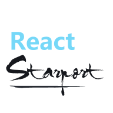

<p align="center">

</p>

<p align="center">
Transform React component across routes with animations
</p>

## Motivation

This project is inspried by [Vue Starport Project](https://github.com/antfu/vue-starport). Thanks all works from the authors.

The mainly work is done, but there are still some featues I have not implemented yet and no ideas.
You can get the list in the [below](#todos).

## Install

```bash
npm install @react-starport/core

yarn add @react-starport/core

pnpm add @react-starport/core
```

## Usage

Add `<StarportCarrier>` component from `@react-starport/core` to your root component (`App.tsx`). All `<Starport>` usage should be inside `<StarportCarrier>` component.

```jsx
import { StarportCarrier } from '@react-starport/core';

function App() {
  return (
    <StarportCarrier> {{/* here */}}    
      <Outlet /> {/* Outlet comes from `react-router`, you can get detail from the doc */}
    </StarportCarrier>
  )
}

export default App;
```

In routes, wrap the component with the `<Starport>` component.

```jsx
/* PageA.jsx */
import { Starport } from '@react-starport/core';

function PageA() {

  return (
    <Starport port="my-id" style="height:400px"> 
      <MyComponent />
    </Starport>
  )
}
```

On the other page, we do the same thing with **the same `port` id** to identify the instance.

```jsx
/* PageA.jsx */
import { Starport } from '@react-starport/core';

function PageB() {

  return (
    <Starport port="my-id" style="height:400px"> 
      <MyComponent />
    </Starport>
  )
}
```

> Note that you might need to apply some styles to `<Starport>` to make it have a defined size indicating the area for the "floating starcraft" to land.

Checkout the [Playground](./packages/playground/) for more examples.

### Options

#### 1. Globally

```jsx
import { StarportCarrier } from '@react-starport/core';

function App() {
  const options = {
    duration: 700,
    easing: 'cubic-bezier(0.45, 0, 0.55, 1)',
  }

  return (
    <StarportCarrier {...options }> 
      <Outlet />
    </StarportCarrier>
  )
}

export default App;
```

#### 2. Specifically

```jsx
/* Page.jsx */
import { Starport } from '@react-starport/core';

function Page() {
  const options = {
    duration: 700,
    easing: 'cubic-bezier(0.45, 0, 0.55, 1)',
  }

  return (
    <Starport port="my-id" style="height:400px" { ...options }> 
      <MyComponent />
    </Starport>
  )
}
```

## Debug

To debug what happens during the transition, you can add the follow CSS to highlight the parts

```css
.debug .starport-craft {
  background: #0805;
}

.debug .starport:not(.starport--landed) {
  background: #8005;
}
```

## TODOS

- [ ] KeepAlive
  - You can use global state as alternative
- [ ] InitialProps and MountedProps
  - I haven't figured out what scenarios would use these configurations

## License

[MIT](./LICENSE) License © 2022 [tyx1703](https://github.com/YanxinTang)
